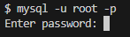
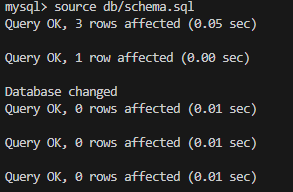
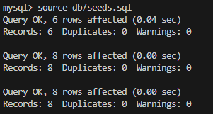
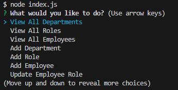

# employee-tracker

## Description

With using mysql and inquirer you're able to answer questions from the terminal and save your answers to the employee database. With the questions you are provided you can view all departments, roles, emplopyees, add departments, add roles, plus many more. Then from the information provided it will be stored into the database.

## Table of Contents

* [Description](#description)
* [Installation](#installation)
* [Usage](#usage)
* [Walkthrough Video](#walkthrough-video)

## Installation

Clone repo then run the following line of code in your terminal to install all the needed packages:
```
npm i
```

## Usage
```
1. Start mysql
```

```
2. Source schema and seeds files
```



```
3. Start nodejs
```


## Walkthrough Video

[Link](https://drive.google.com/file/d/1A-bEKBWiVExGyARraKWoaAZTqfdYt6bV/view)